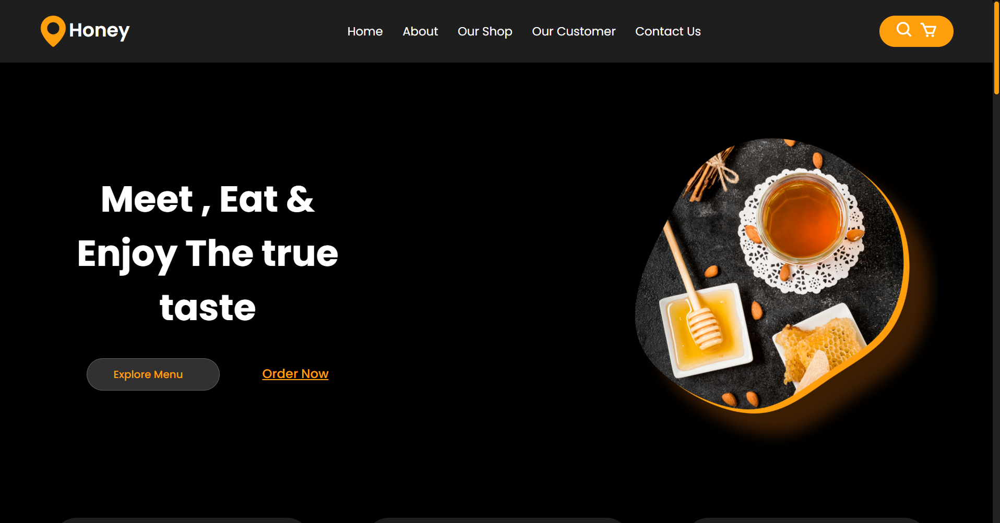

This  website built using only HTML and CSS. This is suitable only for desktop:

Honey Delight - Pure Honey Showcase 🍯
Honey Delight is a simple and elegant static website designed to showcase and promote premium, organic honey products. Built entirely using HTML and CSS, the website features:

Beautiful Product Showcase: Display a variety of honey products with engaging visuals and descriptions.
User-Friendly Navigation: Simple and intuitive design for a seamless browsing experience.
This project demonstrates the power of pure HTML and CSS in creating an attractive and functional food product website.
The preview of website is :

